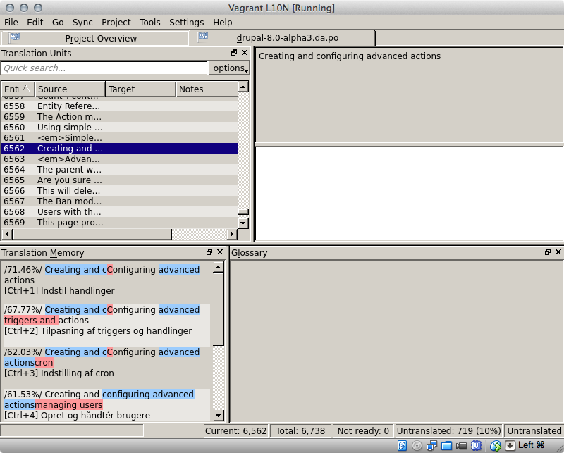

L10N Box
========

Quick start
-----------

1. Run `vagrant up`. This usually takes around ten minutes.
2. Maximize the virtual machine display (optional).
3. Log in as vagrant/vagrant and start working.

Requirements
------------

You need to install [Vagrant](http://www.vagrantup.com) to use this project.
